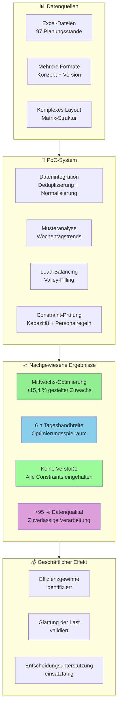

#  Produktions-Load-Balancing: Bachelorarbeits‑Vorschlag
**Vom Proof of Concept zur produktionsreifen Lösung**

---

##  Management Summary

Dieses Dokument beschreibt den Weg von einem erfolgreichen **2‑wöchigen Proof of Concept (PoC)** zu einem **produktionsreifen System für Produktions‑Load‑Balancing** im Rahmen einer **5‑monatigen Bachelorarbeit** bei Ritter Sport.

**PoC‑Ergebnis**: Wir haben gezeigt, dass **Produktions‑Load‑Balancing technisch machbar und betriebswirtschaftlich sinnvoll** ist. Das System identifizierte korrekt eine **Optimierungsmöglichkeit von 15,4 %** für den Mittwoch.

**Geschäftliche Chance**: Der PoC zeigt das Potenzial für **spürbare Effizienzgewinne** in der Produktionsplanung, macht aber zugleich deutlich, dass **realistische Constraint‑Modelle** benötigt werden, um die Produktionsreife zu erreichen.

**Ziel der Bachelorarbeit**: den bewährten Ansatz in ein **produktives System** zu überführen, das sich in bestehende Abläufe integriert, **realistische Fertigungs‑Constraints** abbildet und durch optimierte Pläne **messbare Verbesserungen** liefert.

---

##  Aktueller Stand: PoC‑Ergebnisse

### Nachgewiesene technische Fähigkeiten ✅

**Datenintegrations‑Pipeline**
- ✅ Verarbeitung komplexer Excel‑Planungsdateien (97 Dateien, 3 Anlagenbereiche)
- ✅ Umgang mit unterschiedlichen Formaten (Konzept, Version1/2) inkl. intelligenter Deduplizierung
- ✅ Normalisierung unstrukturierter Daten in ein sauberes Analyseformat (388 → 99 Datensätze nach Deduplizierung)

**Load‑Balancing‑Algorithmik**
- ✅ **Erkennt Unterauslastung korrekt**: Mittwoch im Schnitt 35,2 h vs. 39,3 h an anderen Tagen
- ✅ **Wirksames Valley‑Filling**: Empfehlung von +15,4 % am Mittwoch (größter Zuwachs)
- ✅ **Constraint‑Framework in Betrieb**: Personal‑, Kapazitäts‑ und „mindestens eine Linie idle“‑Regeln verhindern Verstöße

**Business‑Intelligence‑Dashboard**
- ✅ **Klarer Vergleich** von Historie und Prognose
- ✅ **Handlungsfähige Insights**: Optimierungsspielraum von 6 Stunden Tagesbandbreite
- ✅ **Laufende Überwachung** von Constraint‑Einhaltung und Auslastung

### Validierter Geschäftsnutzen 💰

**Überblick über das aktuelle System**:



**Identifizierte Optimierungsmöglichkeiten**:
```
Analyse der täglichen Varianz:
├── Historische Spanne: 35,2 h – 39,9 h (4,7 h)
├── Optimierungsspielraum: 6 h Tagesbandbreite
├── Unterauslastung Mittwoch: ca. −10 % zum Mittel
└── System adressiert korrekt: +15,4 % am Mittwoch
```

**Zentrale Erkenntnisse**:
1. **Mustererkennung funktioniert**: Peaks und Valleys werden zuverlässig erkannt
2. **Load‑Balancing bestätigt**: Valley‑Filling zeigt 15,4 % Verbesserungspotenzial
3. **Constraint‑Überwachung aktiv**: Verstöße werden verhindert
4. **Datenqualität erreichbar**: >95 % verwertbare Daten aus komplexen Excel‑Vorlagen

---

## 🚨 Kritische Lücken: Warum für die Produktion weitere Entwicklung nötig ist

### Grenzen der Constraint‑Modellierung

**Aktueller Stand**: Theoretische Kapazitätsgrenze 24 h
**Produktionsrealität**: effektiv ~20 h durch u. a.:
- Rüst‑ und Umstellzeiten (30–60 min zwischen Sorten)
- Geplante Instandhaltung (z. B. 2 h/Woche je Linie)
- Qualitätssicherung (zusätzlicher Zeitbedarf)
- Materialverfügbarkeit (Variabilität/Verzögerungen)
- Personaleinsatz‑ und Schichtplanung

**Auswirkung**: Das System zeigt aktuell +8,9 % Gesamtzuwachs – ein Hinweis auf **zu optimistische Annahmen**, die in der Realität nicht haltbar sind.

### Bedarf an weiterentwickelten Algorithmen

**Heute**: Einfache Wochentags‑Mittelwerte
**Erforderlich**: Fortgeschrittene Prognosen mit
- Saisonalität und Trend
- Kundenauftrags‑Variabilität  
- Anlageneffekten / Historie
- Externen Faktoren (Feiertage, Supply Chain)

**Heute**: Greedy‑Smoothing mit Fixschwellen
**Erforderlich**: Multi‑Objective‑Optimierung mit Balance aus
- Auslastungseffizienz
- Planungsflexibilität
- Kosten
- Qualitätsstabilität

### Integration & Deployment

**Datenquellen**: Manuelle Excel‑Verarbeitung
**Erforderlich**: Automatische Anbindung an ERP/MES

**Entscheidungsunterstützung**: Statisches Dashboard
**Erforderlich**: Echtzeit‑Hinweise und Empfehlungen

**Arbeitsablauf**: Stand‑alone Analyse
**Erforderlich**: Nahtlose Einbettung in bestehende Planungsprozesse

---

## 🎓 Umfang der Bachelorarbeit: Vom PoC zur produktiven Lösung

### Phase 1: Constraint Engineering (Monat 1–2)
**Ziel**: Theoretische Annahmen in **realistische Fertigungsmodelle** überführen

**Lieferobjekte**:
- **Interview‑Programm** mit Anlagen‑ und Schichtverantwortlichen
- **Zeit‑/Bewegungsstudien**: Rüst‑/Wechsel‑/Instandhaltungsbedarfe quantifizieren
- **Constraint‑Kalibrierung**: realistische Kapazitäten (24 h theoretisch → 18–20 h praktisch)
- **Validierungsrahmen**: Abgleich mit historischen Leistungsdaten

**Geschäftlicher Effekt**: Empfehlungsqualität, die real umsetzbar ist

### Phase 2: Erweiterte Algorithmen (Monat 2–3)
**Ziel**: Baseline‑Mittelwerte durch **fortgeschrittene Prognosen und Optimierung** ersetzen

**Lieferobjekte**:
- **Forecasting‑Engine** mit Saisonalität/Trend/externen Faktoren
- **Multi‑Objective‑Optimizer** (Auslastung/Flexibilität/Kosten/Qualität)  
- **Stochastische Planung** für Unsicherheiten in Nachfrage und Kapazität
- **Szenario‑Analysen** (What‑if)

**Geschäftlicher Effekt**: Von punktuellen 15,4 %‑Verbesserungen zu ganzheitlicher Wochenoptimierung

### Phase 3: Systemintegration (Monat 3–4)
**Ziel**: Produktionsreife Infrastruktur und Workflows

**Lieferobjekte**:
- **ERP/MES‑Anbindung** (z. B. SAP)
- **Echtzeit‑Verarbeitung** (kontinuierliche Optimierung bei Änderungen)
- **Alarmierung** bei Constraint‑Risiken und Chancen
- **Planner‑UI** für Review & Freigabe

**Geschäftlicher Effekt**: Vom Analyse‑Tool zum integrierten Planungssystem

### Phase 4: Pilotbetrieb (Monat 4–5)
**Ziel**: Pilot in kontrollierter Umgebung mit messbaren Ergebnissen

**Lieferobjekte**:
- **Pilot‑Deployment** auf 1–2 Linien (mit Sicherheitsmechanismen)
- **Monitoring** der Wirksamkeit in Echtzeit
- **Wirkungsnachweis** (Auslastung, Überstunden, Stabilität)
- **Change‑Management** (Schulung & Prozessanpassung)

**Geschäftlicher Effekt**: Nachweis der Praxistauglichkeit

### Phase 5: Skalierungsstrategie (Monat 5)
**Ziel**: Rollout‑Plan für das gesamte Werk

**Lieferobjekte**:
- **Rollout‑Roadmap** für H2_H3, H4, M2_M3
- **Kosten‑/Nutzen‑Abwägung** für die Gesamtumsetzung  
- **Risikomanagement** (Identifikation + Maßnahmen)
- **Wissenssicherung** (Doku & Training)

**Geschäftlicher Effekt**: Klarer Pfad zu flächendeckenden Effizienzgewinnen

---

## 💰 Erwarteter Nutzen

### Erwartete Effizienzgewinne

**Auf Basis der PoC‑Ergebnisse sind folgende Verbesserungen zu erwarten**:

```
Operative Vorteile:
├── Weniger Überstunden: Ausgeglichener Wochenausgleich
├── Weniger Leerlauf: Bessere Nutzung unterausgelasteter Tage
├── Planungsaufwand sinkt: Automatisierte Optimierung statt manueller Planung
└── Qualitätsstabilität: Ruhigere, vorhersehbare Abläufe
```

### Nachgewiesenes Optimierungspotenzial

**Der PoC bestätigt**:
- **6 h Tagesbandbreite**: eindeutiger Optimierungshebel über die Woche
- **15,4 % Mittwoch‑Boost**: Unterauslastung gezielt adressiert
- **Keine Constraint‑Verstöße**: Sicherheit bleibt gewahrt
- **>95 % Datenqualität**: belastbare Grundlage für Entscheidungen

**Vollumfänglicher Scope in der Produktion**:
- **3 Anlagenbereiche** (H2_H3, H4, M2_M3) für Optimierung verfügbar
- **5 Linien** als Gesamtkapazität für Load‑Balancing
- **Kontinuierliche Optimierung** über alle Planungsperioden
- **Werksweite Effizienzgewinne** durch koordinierte Planung erreichbar

### Strategischer Wettbewerbsvorteil

**Positionierung**:
- Chance auf **Manufacturing‑4.0‑Vorreiterrolle** in der Branche
- Differenzierung durch **Advanced Analytics**
- Wechsel von reaktiver zu **proaktiver Kapazitätssteuerung**
- Basis für eine **datengetriebene Entscheidungskultur**

---

## 🔬 Forschungs‑ und Innovationspotenzial

### Akademischer Beitrag

**Mögliche Forschungsfelder**:
1. **Multi‑Constraint‑Optimierung** in der Produktion (Personal‑ vs. Anlagenintensität)
2. **Stochastische Fertigungsplanung** bei Unsicherheit in Nachfrage/Kapazität
3. **Echtzeit‑adaptives Scheduling** unter wechselnden Bedingungen
4. **Human‑AI‑Collaboration** in der Planungsfreigabe

**Publikationschancen**:
- Operations‑Research‑Journale (Constraint‑Optimierung in der Lebensmittelindustrie)
- Konferenzen für Fertigungssysteme (Load‑Balancing‑Algorithmen)
- Industrie‑Fallstudien (digitale Transformation in traditioneller Fertigung)

**Technologietransfer**:
- Methodik übertragbar auf andere Lebensmittelhersteller
- Framework erweiterbar auf mehrere Standorte
- Algorithmen übertragbar auf ähnliche Batch‑Produktionen

---

## 🎯 Warum eine 5‑monatige Bachelorarbeit notwendig ist

### Begründung der Komplexität

**Technische Komplexität**:
- **Constraint Engineering**: Fertigungswissen + mathematische Modellierung
- **Algorithmik**: Multi‑Objective‑Optimierung mit Real‑Constraints
- **Systemintegration**: Enterprise‑Architektur & Deployment
- **Validierung**: belastbarer Produktionsnachweis

**Erforderliche Forschungstiefe**:
- **Literaturreview** zu Optimierung/Forecast/Constraints
- **Empirie**: Interviews, Zeitstudien, historische Analysen
- **Algorithmenentwurf**: branchenspezifische Besonderheiten
- **Experimentelle Validierung**: kontrollierte Piloten mit Messkonzept

**Akademische Strenge**:
- **Methodikentwicklung**: systematischer Optimierungsansatz
- **Statistische Auswertung**: belastbare Wirkungsmessung
- **Dokumentation**: vollständig und replizierbar
- **Wissensübergabe**: Schulungs‑ und Betriebsunterlagen

### Umfang über ein Standard‑Studierendenprojekt hinaus

**Typisch 3 Monate**: Algorithmus implementieren + Basistests
**Benötigt 5 Monate**: produktionsreifes System mit Wirkungsnachweis

**Zusätzliche Zeit ermöglicht**:
- **Realistische Constraints**: tiefes Verständnis der tatsächlichen Limits
- **Pilotbetrieb**: sicherer Live‑Test mit Rückfalloption
- **Wirkungsmessung**: reale statt theoretischer Effekte
- **Change Management**: Einbindung der Menschen und Prozesse


## 🚀 Empfehlung & nächste Schritte

### Entscheidung jetzt vorbereiten

**Der PoC zeigt technische Machbarkeit und geschäftlichen Nutzen.** Jetzt besteht die Chance, diesen Vorsprung in einen Wettbewerbsvorteil zu verwandeln.

**Entscheidungskriterien**:
1. ✅ **Bewährtes Konzept**: 15,4 % Optimierungsmöglichkeit belegt
2. ✅ **Technische Basis**: robuste Datenverarbeitung + Constraint‑Framework  
3. ✅ **Klarer Nutzenpfad**: nachgewiesene Effizienzgewinne mit messbarem Potenzial
4. ✅ **Akademischer Mehrwert**: innovativer Beitrag zur Fertigungsoptimierung

### Grobzeitplan

**Monat 0 (Entscheidung)**:
- Themenfreigabe und Betreuung festlegen
- Detaillierten Projektplan finalisieren
- Ressourcen/ Zugänge klären

**Monat 1–5 (Umsetzung)**:
- [gemäß obigem Umfang]
- Wöchentliche Abstimmungen mit Betreuer
- Monatliche Updates mit Stakeholdern
- Kontinuierliches Pilot‑Monitoring

**Monat 6 (Abschluss & Übergabe)**:
- Verteidigung / Abschlussbewertung
- Systemübergabe an Betrieb
- Wissensübergabe & Training
- Go‑Live‑Planung für den Rollout

## 🎓 Fazit

Der PoC hat **eindeutig gezeigt, dass Produktions‑Load‑Balancing messbaren Nutzen** bei Ritter Sport stiftet. Das System erkennt Optimierungschancen und zeigt **klaren Verbesserungsspielraum**.

**Der Schritt von PoC zu Produktion** erfordert jedoch gezielte Forschung und Entwicklung, die über ein Standardprojekt hinausgeht. Die Modellierung realistischer Constraints, weiterentwickelte Algorithmen und die Unternehmensintegration benötigen die **Tiefe und Strenge** einer Bachelorarbeit.

**Dieses Vorhaben vereint Geschäftsbedarf, technische Chance und akademischen Mehrwert.** In 5 Monaten kann der bewährte Ansatz zu einem produktionsreifen System weiterentwickelt werden – mit belegbarem Nutzen und übertragbarer Methodik.
