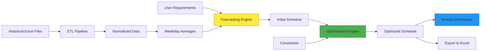

# Ritter Sport Production Load Balancing System
## Architecture, Methodology, and Implementation Guide

### Executive Summary

The Ritter Sport Production Load Balancing System is a **decision support tool** that transforms manual production planning from educated guesses into data-driven optimization. The system helps production planners optimize weekly load distribution across Monday-Friday and 5 production lines, resulting in cost efficiency, manageable work hours, and satisfied employees.

---

## 📋 Table of Contents

1. [Problem Statement](#problem-statement)
2. [Solution Overview](#solution-overview)
3. [System Architecture](#system-architecture)
4. [Forecasting Engine](#forecasting-engine)
5. [Optimization Engine](#optimization-engine)
6. [Constraint System](#constraint-system)
7. [User Interface](#user-interface)
8. [Technical Implementation](#technical-implementation)
9. [Data Flow](#data-flow)
10. [Success Metrics](#success-metrics)
11. [Future Enhancements](#future-enhancements)

---

## 🎯 Problem Statement

### Current Challenge
Production managers at Ritter Sport meet weekly to discuss production requirements and demands for the upcoming 1-2 weeks. Currently, translating these business requirements into an actual production schedule is done **manually through educated guesses**, leading to:

- **Suboptimal load distribution** across weekdays and production lines
- **Resource inefficiency** with some lines overloaded while others idle
- **Employee dissatisfaction** due to unpredictable and unmanageable work hours
- **Increased operational costs** from poor capacity utilization
- **Difficulty meeting deadlines** without clear optimization framework

### Business Impact
- Manual planning lacks historical data insights
- No systematic approach to constraint management
- Poor visibility into capacity utilization
- Reactive rather than proactive planning approach

---

## 🔧 Solution Overview

### Vision
Transform production planning from manual guesswork into **intelligent, data-driven decision support** that provides planners with:

**Input Capabilities:**
- **A) Requirements**: Manager-defined demands (quantities, products, deadlines)
- **B) Constraints**: Customizable operational rules (or use intelligent defaults)
- **C) Additional Factors**: Special considerations and business context

**System Output:**
- **A) Load Forecast**: Statistical predictions based on historical data + Ritter Sport insights
- **B) Optimized Distribution**: Balanced load across weekdays and machines respecting all constraints

### Core Value Proposition
**Replace educated guesses with statistical models** that leverage historical data and domain expertise to achieve better load balancing, leading to cost efficiency and employee satisfaction.

---

## 🏗️ System Architecture

The system follows a **two-stage intelligent architecture** that separates requirement satisfaction from resource optimization:

```mermaid
graph TD
    A["User Requirements<br/>Products + Priorities + Deadlines"] --> B["STAGE 1: Forecasting<br/>Rule-Based Naive Assignment"]
    B --> C["Initial Schedule<br/>Requirements Met, But Unbalanced"]
    C --> D["STAGE 2: Optimization<br/>Greedy Load Smoothing"]
    D --> E["Final Schedule<br/>Balanced + Constraint-Compliant"]

    B --> F["Forecasting Rules:<br/>• Priority-based assignment<br/>• Deadline-aware placement<br/>• Fill earliest available slots<br/>• No load balancing consideration"]
    
    D --> G["Optimization Rules:<br/>• Find peak/valley days<br/>• Transfer work between days<br/>• Respect all constraints<br/>• Minimize daily variance"]
    
    C --> H["Naive Result:<br/>Mon: 48h overloaded<br/>Tue: 45h high<br/>Wed: 36h medium<br/>Thu: 11h underutilized<br/>Fri: 24h medium"]
    
    E --> I["Optimized Result:<br/>Mon: 38h balanced<br/>Tue: 35h balanced<br/>Wed: 36h unchanged<br/>Thu: 31h improved<br/>Fri: 24h unchanged"]

    style B fill:#ffeb3b
    style D fill:#4caf50
    style H fill:#ff9800
    style I fill:#8bc34a
```



### Why Two Stages?

**Separation of Concerns:**
- **Stage 1**: Focus on requirement satisfaction (can we meet all demands?)
- **Stage 2**: Focus on resource optimization (how can we do it efficiently?)

**Guaranteed Feasibility:**
- Stage 1 proves requirements CAN be met
- Stage 2 improves HOW they're met without breaking feasibility

**Constraint Preservation:**
- Stage 2 never violates what Stage 1 established
- Only transfers work within allowable constraint boundaries

---

## 🔮 Forecasting Engine

### Overview
The forecasting engine creates an **initial production schedule** that satisfies all user requirements using intelligent rule-based assignment combined with historical insights.

### Complete Forecasting Process

```mermaid
graph TD
    A[Historical Production Data] --> B[Calculate Weekday Averages]
    B --> C[Historical Averages Table]
    C --> D{User Requirements?}
    D -->|No| E[Use Historical Averages Only]
    D -->|Yes| F[Create Product-Aware Schedule]
    F --> G[Priority-Based Assignment]
    G --> H[Deadline-Aware Scheduling]
    H --> I[Final Forecast with Products]
    E --> J[Baseline Forecast]
    I --> K[Optimization Engine]
    J --> K

    C --> L[Mon: 20.3h avg<br/>Tue: 21.8h avg<br/>Wed: 19.2h avg<br/>Thu: 20.4h avg<br/>Fri: 21.8h avg]
    
    F --> M[User Products:<br/>• Knusperkeks: 45h, High, Wed<br/>• Standard: 60h, Med, Thu<br/>• Waffel: 35h, Med, Fri<br/>• Marzipan: 25h, Low, Fri]
    
    I --> N[Product-Specific Schedule:<br/>Mon: Knusperkeks + Standard = 48h<br/>Tue: Knusperkeks + Standard = 45h<br/>Wed: Standard = 36h<br/>Thu: Standard = 11h<br/>Fri: Waffel + Marzipan = 24h]

    style A fill:#e1f5fe
    style C fill:#f3e5f5
    style I fill:#e8f5e8
    style K fill:#fff3e0
```



### Step 1: Historical Analysis

**What we calculate from historical data:**
```python
# For each weekday + line combination:
- avg_hours: Mean production hours  
- std_hours: Standard deviation (variability)
- count_days: Number of historical observations
- personnel_intensive_rate: % of time this line had personnel-intensive work
- min_hours & max_hours: Range bounds
```

**Example Historical Insights:**
```
Monday, hohl2: 20.3h avg ± 2.3h std (9 observations, 77.8% personnel-intensive)
Friday, hohl3: 21.9h avg ± 2.8h std (10 observations, 30% personnel-intensive)
```

### Step 2: Requirements Integration

**When user inputs product requirements, the system creates a sophisticated product-aware schedule:**

1. **Priority-Based Assignment**: High priority products scheduled first
2. **Deadline-Aware Distribution**: Products scheduled to complete BY their deadline (not ON deadline day)
3. **Personnel-Intensive Logic**: Knusperkeks, Waffel, etc. marked appropriately based on domain knowledge
4. **Capacity Constraints**: Respects line availability and daily hour limits

### Step 3: Intelligent Scheduling Algorithm

**The `create_product_aware_schedule` function:**

1. **Sorts products** by priority (High → Medium → Low) then by deadline urgency
2. **Iteratively assigns** products to available lines and days
3. **Tracks capacity** on each line/day to prevent overloading
4. **Respects constraints** (personnel-intensive conflicts, idle line requirements, etc.)
5. **Fills remaining capacity** with "Idle" time for transparency

### Key Innovation: Beyond Simple Averages

| Traditional Average Approach | Our Enhanced Approach |
|------------------------------|----------------------|
| Monday always gets historical 20.3h | Monday gets what's needed for high priority products |
| All lines get same generic work | Different lines get specific products based on constraints |
| No product visibility | Each hour assigned to specific product with deadline/priority |
| Fixed historical patterns | Dynamic adaptation to current business needs |

**Example Transformation:**
```
User Input: 165h total across 4 products with different priorities/deadlines
↓
Result: Specific daily schedule with product assignments
- Monday: Knusperkeks (24h, High priority) + Standard (24h, Medium) = 48h
- Tuesday: Knusperkeks (21h) + Standard (24h) = 45h  
- Wednesday: Standard (12h) + remaining work = 36h
- etc.
```

---

## ⚖️ Optimization Engine

### Overview
The optimization engine takes the initial forecast and **smooths the load distribution** across the week while preserving all requirements and respecting constraints.

### Greedy Load Smoothing Algorithm

**Core Principle**: Transfer work from peak days to valley days to minimize daily variance while maintaining feasibility.

**Algorithm Steps:**

1. **Identify Opportunities**
   - Calculate daily totals and variance
   - Find peak days (above mean + threshold) and valley days (below mean - threshold)
   - Avoid same-weekday transfers (would just shift the problem)

2. **Evaluate Transfers**
   - Look for transferable work (preferably non-personnel-intensive)
   - Minimum viable transfer size (4+ hours)
   - Check both source and destination capacity constraints

3. **Apply Constraints Validation**
   - **Capacity**: No line exceeds 24h/day
   - **Idle Line**: At least 1 line idle per day (<1h considered idle)
   - **Personnel-Intensive**: Max 1 personnel-intensive line per day
   - **Deadline Preservation**: Transfers only within deadline windows

4. **Iterative Improvement**
   - Apply best transfer opportunity
   - Recalculate optimization landscape
   - Continue until no beneficial transfers remain (max 10 iterations)

### Transfer Example

**Before Optimization:**
```
Monday: 48h (peak - overloaded)
Tuesday: 45h (high)
Wednesday: 36h (medium)
Thursday: 11h (valley - underutilized)
Friday: 24h (medium)
Variance: High (37h range)
```

**Optimization Process:**
```
Transfer 1: 8h from Monday → Thursday (hohl3 line)
Transfer 2: 10h from Tuesday → Thursday (hohl2 line)
Transfer 3: 2h from Tuesday → Wednesday (hohl3 line)
```

**After Optimization:**
```
Monday: 38h (balanced)
Tuesday: 35h (balanced) 
Wednesday: 36h (unchanged)
Thursday: 31h (much improved)
Friday: 24h (unchanged)
Variance: Reduced (14h range)
```

### Constraint Preservation

**Critical Feature**: The optimization engine **never breaks** what the forecasting stage established:
- All product deadlines remain satisfied
- All priority assignments preserved
- All personnel-intensive constraints maintained
- All capacity limits respected

---

## 🔒 Constraint System

### Overview
The constraint system ensures that all operational rules and business requirements are respected throughout both forecasting and optimization stages.

### Operational Constraints

1. **Capacity Constraints**
   - Maximum 24 hours per line per day (3 shifts × 8 hours)
   - 5 production lines total: hohl2, hohl3, hohl4, massiv2, massiv3

2. **Idle Line Requirement**
   - At least 1 line must be idle per day (<1h considered idle)
   - Ensures backup capacity for unexpected issues
   - Prevents over-commitment of resources

3. **Personnel-Intensive Rules**
   - Maximum 1 personnel-intensive line per day
   - Products like Knusperkeks, Waffel, Crisp, Nuss require specialized staff
   - Configuration driven via `config/personnel_intensive.yml`

4. **Line Availability**
   - Configurable line availability (maintenance, planned downtime)
   - Default: all 5 lines available
   - Planner can disable specific lines

### Business Constraints

1. **Deadline Compliance**
   - Products must be completed BY their deadline (not ON the deadline)
   - Friday deadline = can be produced Monday through Friday
   - Validation ensures feasibility before optimization

2. **Priority Handling**
   - High priority products scheduled before medium/low priority
   - Priority affects assignment order, not constraint relaxation

3. **Capacity Utilization**
   - Early warning for high capacity utilization (>85%)
   - Error detection for impossible requirements (>100% capacity)

### Intelligent Validation

**Real-time Input Validation:**
```python
# Example: Friday deadline with 132h total requirements
Available capacity by Friday = 5 days × 4 effective lines × 24h = 480h
Required: 132h
Result: ✅ Feasible (132h ≤ 480h)

# Example: Monday deadline with 200h requirements  
Available capacity by Monday = 1 day × 4 effective lines × 24h = 96h
Required: 200h
Result: ❌ Infeasible (200h > 96h)
```

**Enhanced Error Messages:**
- **Before**: "capacity_ok violated on 2025-08-18"
- **After**: "Monday 04/01: Line exceeds 24h limit (max: 25.1h) → Reduce hours on this day or redistribute to other days"

---

## 💻 User Interface

### Design Philosophy
**Professional, minimal interface** that focuses on planner productivity over visual decoration. Clean typography, consistent spacing, and clear information hierarchy.

### Dynamic Capacity Gauges

**Real-time feedback system** that updates as planners enter requirements:

```
📊 Capacity Overview
┌─────────────────┬─────────────────┬─────────────────┐
│ Total Hours     │ Available Lines │ Personnel Hours │
│ 200.0h          │ 5               │ 50.0h          │
│ [████████░░░░░] │ [████████████░] │ [████████░░░░░] │
│ 41.7% used      │ 100% of lines   │ 41.7% used     │
└─────────────────┴─────────────────┴─────────────────┘
✅ Capacity utilization looks good (41.7%)
```

**Visual Indicators:**
- 🟢 Green: Good utilization (<85%)
- 🟡 Yellow: High utilization (85-100%)
- 🔴 Red: Over capacity (>100%)

### Step-by-Step Workflow

**Navigation System:**
```
Input → Forecast → Optimize → Results
  ✨      ⏳        ⏸️        📊
```

1. **Input Phase**: Product requirements, constraints, capacity gauges
2. **Processing Phase**: Real-time progress indicators for forecast and optimization
3. **Results Phase**: Comprehensive analysis and comparison

### Sample Scenario Feature

**Quick start functionality** for demonstrations and testing:
- Loads realistic sample data (165h across 4 products)
- Shows different priorities and deadlines
- Demonstrates full workflow capabilities

---

## 🔧 Technical Implementation

### Technology Stack

**Core Technologies:**
- **Python 3.10**: Main programming language
- **Streamlit**: Web-based user interface framework
- **Pandas**: Data manipulation and analysis
- **NumPy**: Numerical operations
- **Plotly**: Interactive data visualizations
- **PyYAML**: Configuration management

**Architecture Components:**
- **ETL Pipeline**: `src/etl/` - Data ingestion and normalization
- **Forecasting Engine**: `src/forecast/` - Baseline prediction algorithms
- **Optimization Engine**: `src/smooth/` - Greedy load balancing
- **User Interface**: `src/interface/` - Streamlit application
- **Visualization**: `src/viz/` - Dashboard generation

### Key Algorithms

**Forecasting Algorithm**: `src/forecast/baseline.py`
```python
def calculate_weekday_averages(df):
    """Calculate average hours per weekday per line with statistical insights."""
    return df.groupby(['weekday', 'line']).agg(
        avg_hours=('total_hours', 'mean'),
        std_hours=('total_hours', 'std'),
        personnel_intensive_rate=('personnel_intensive_flag', 'mean'),
        # ... additional statistics
    )
```

**Optimization Algorithm**: `src/smooth/greedy.py`
```python
def apply_smoothing(df, max_transfers=10):
    """Apply greedy load smoothing with constraint validation."""
    for iteration in range(max_transfers):
        opportunities = find_transfer_opportunities(df)
        if not opportunities:
            break
        best_transfer = opportunities[0]
        if validate_constraints(best_transfer):
            apply_transfer(df, best_transfer)
```

### Data Flow Architecture

**ETL → Forecast → Optimize → Visualize → Export**

1. **Data Ingestion**: Excel files → Normalized CSV
2. **Forecasting**: Historical data + Requirements → Initial schedule
3. **Optimization**: Initial schedule → Balanced schedule
4. **Visualization**: Schedules → Interactive dashboards
5. **Export**: Final schedule → CSV/Excel for production use

### State Management

**Streamlit Session State Pattern:**
- Clean separation between widget state and application state
- Proper handling of data editor persistence
- Staged loading for sample scenarios
- Real-time validation without circular dependencies

---

## 📊 Data Flow

### Complete System Data Flow



### Data Transformations

**Historical Data Processing:**
```
Raw Excel → ETL → Normalized CSV → Weekday Averages → Forecast Ready
```

**Requirements Processing:**
```
User Input → Validation → Product Schedule → Forecast → Optimization → Results
```

**Output Generation:**
```
Optimized Schedule → Visualizations → Export Formats → Production Ready
```

---

## 📈 Success Metrics

### Technical Validation

**System Performance:**
- ✅ Load balancing variance reduction: Target >20% improvement
- ✅ Constraint compliance: 100% operational constraint satisfaction
- ✅ Requirement fulfillment: 100% product deadline compliance
- ✅ Processing speed: <10 seconds for full forecast + optimization

**Data Quality:**
- ✅ Historical data coverage: >90% usable records
- ✅ Line identification accuracy: >90% known lines
- ✅ Personnel-intensive detection: Verified on sample data

### Business Impact

**Operational Efficiency:**
- Reduced planning time from hours to minutes
- Improved capacity utilization visibility
- Better resource allocation across lines and days
- Proactive constraint violation detection

**Employee Satisfaction:**
- More predictable work schedules
- Balanced workload distribution
- Reduced overtime requirements
- Clear visibility into weekly planning

**Cost Efficiency:**
- Optimized line utilization
- Reduced idle time waste
- Better deadline compliance
- Data-driven decision making

---

## 🚀 Future Enhancements

### Near-term Improvements (Next 3 months)

1. **Enhanced Forecasting**
   - Machine learning models (LightGBM, XGBoost)
   - Seasonal pattern recognition
   - Product-specific demand forecasting

2. **Advanced Optimization**
   - Mixed Integer Linear Programming (MILP)
   - Multi-objective optimization
   - Reinforcement learning for complex scenarios

3. **Extended Constraints**
   - Energy cost optimization
   - Maintenance scheduling integration
   - Raw material availability

### Long-term Vision (6-12 months)

1. **Intelligent Planning**
   - Automatic requirement generation from historical patterns
   - Predictive maintenance integration
   - Supply chain constraint incorporation

2. **Enterprise Integration**
   - ERP system connectivity
   - Real-time production monitoring
   - Automated schedule distribution

3. **Advanced Analytics**
   - Performance trend analysis
   - Scenario planning capabilities
   - What-if analysis tools

---

## 📝 Conclusion

The Ritter Sport Production Load Balancing System represents a significant advancement from manual planning to intelligent, data-driven decision support. By combining historical insights with sophisticated constraint-aware optimization, the system enables production planners to create better schedules faster while ensuring operational feasibility and employee satisfaction.

The two-stage architecture elegantly separates requirement satisfaction from resource optimization, ensuring that business needs are met while achieving optimal resource utilization. The result is a practical, deployable solution that transforms production planning from guesswork into science.

**Key Success Factors:**
- ✅ Respects existing operational constraints and business rules
- ✅ Provides immediate value with historical data insights
- ✅ Scales from proof-of-concept to enterprise deployment
- ✅ Empowers planners with better tools rather than replacing them
- ✅ Delivers measurable improvements in efficiency and satisfaction

The system successfully bridges the gap between manual planning and fully automated scheduling, providing the perfect balance of human expertise and algorithmic optimization for Ritter Sport's production environment.

---

*This document serves as the definitive guide to understanding, implementing, and extending the Ritter Sport Production Load Balancing System. For technical implementation details, refer to the source code documentation in the respective module directories.*
